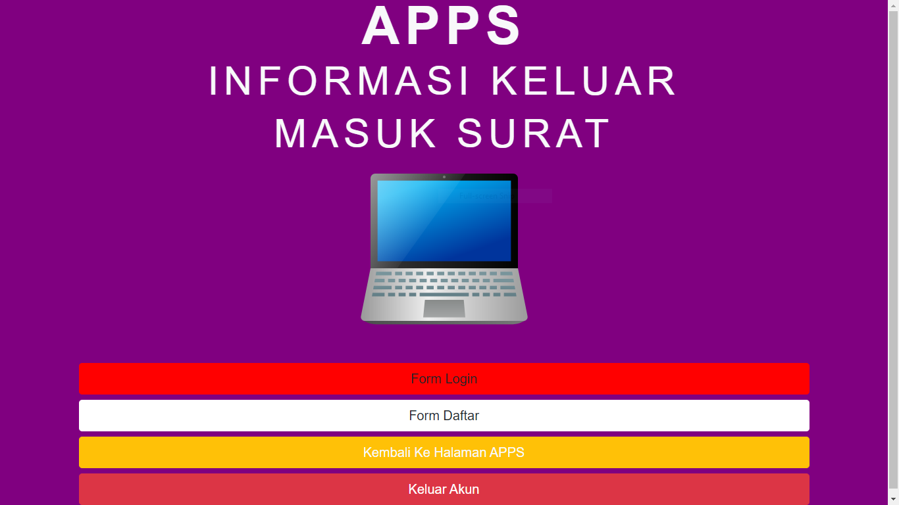
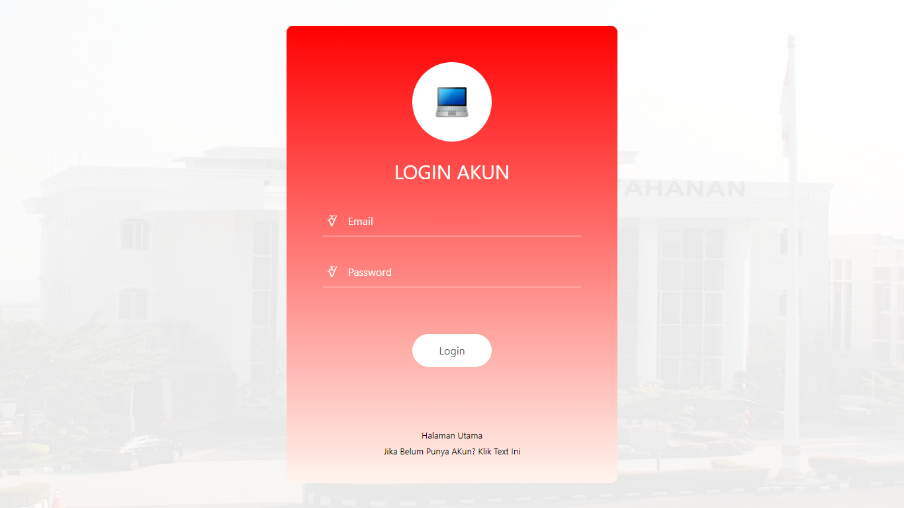
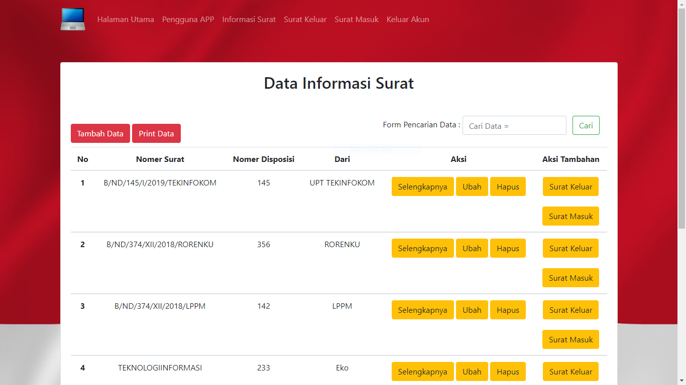

## Aplikasi Informasi Keluar Masuk Surat

## Fitur Aplikasi

- Login 
- Register 
- Logout 
- Halaman Utama
    
  A. Pengguna Apps / Data Users 
- Tambah Data (Pengguna Apps / Data Users) 
- Ubah Data (Pengguna Apps / Data Users) 
- Hapus Data (Pengguna Apps / Data Users) 
- Print Data (Pengguna Apps / Data Users) 
- Cari Data (Pengguna Apps / Data Users)  
  B. Data Informasi Surat
- Tambah Data (Data Informasi Surat) 
- Ubah Data (Data Informasi Surat) 
- Detail Data (Data Informasi Surat) 
- Hapus Data (Data Informasi Surat) 
- Print Data (Data Informasi Surat) 
- Cari Data (Data Informasi Surat) 
- Seleksi Data Surat Masuk (Data Informasi Surat)
- Seleksi Data Surat Keluar (Data Informasi Surat)
    
  C. Data Surat Masuk
- Detail Data (Data Surat Masuk) 
- Hapus Data (Data Surat Masuk) 
- Print Data (Data Surat Masuk) 
- Cari Data (Data Surat Masuk)  
  D. Data Surat Keluar
- Detail Data (Data Surat Keluar) 
- Hapus Data (Data Surat Keluar) 
- Print Data (Data Surat Keluar) 
- Cari Data (Data Surat Keluar) 

## Aplikasi Screenshot

## Alat Yang Digunakan Untuk Membuat Web :

A. Hardware :
Laptop Aspire E1-472G. Speaksifikasi :

- Ram : 4GB DD3 L Memory
- Prosesor : Intel Core i5-4200U 1.6 GHz with Turbo Boost up to 2.5 GHz
- Tipe System : 64 bit
- VGA : NVIDIA GEFORCE GT 720M with 2GB Dedicated VRAM
- SSD : 128 GB

B. Software :

- XAMPP
- Sublime Text 3
- Bootstrap 4
- PHP 7.2
- MYSQL
